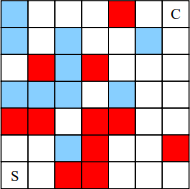

# Szoftverfejlesztés beadandó

Ez a repository a beadandó projektmunkámat tartalmazza a Szoftverfejlesztés c. tárgyra. A számomra kijelölt [feladat](https://arato.inf.unideb.hu/jeszenszky.peter/download/mestint/feladatok.pdf) a 2.43-as volt. A feladat leírása a következő volt:

Az ábrán látható tábla S jelű mezőjére helyezett figurával a C jelű mezőre kell eljutni. A figurát minden lépésben függőlegesen vagy vízszintesen lehet elmozdítani egy mezővel. A fehér mezőkről előre kell lépni, azaz abba az irányba, amelybe a figura a megelőző lépésben lépett. (Az előző lépés iránya a figura haladási iránya). A piros mezőkről a figurával előre lehet lépni, vagy pedig a haladási irányhoz képest jobbra fordulva, a kék mezőkről előre, vagy pedig balra fordulva. Az első lépést megelőzően a figura haladási iránya észak, tehát az induló mezőről a figurával abba az irányba kell lépni.
